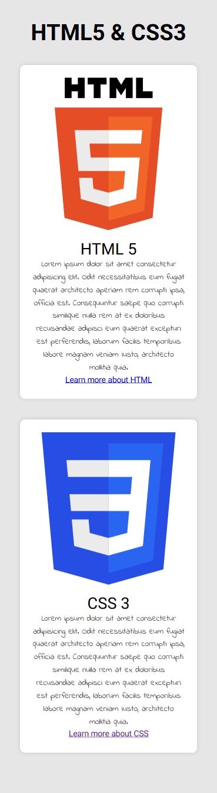
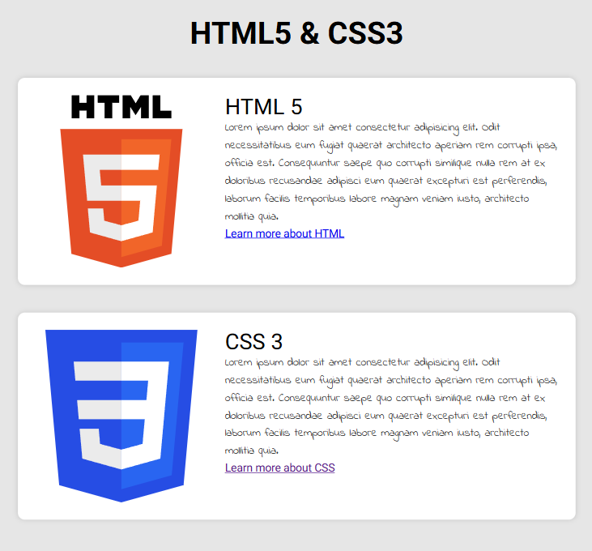
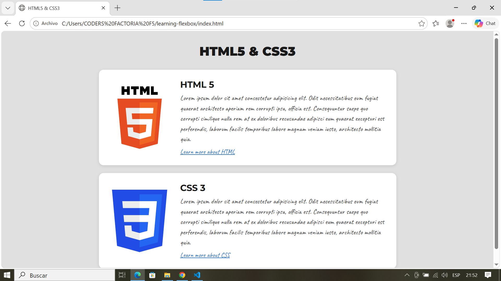
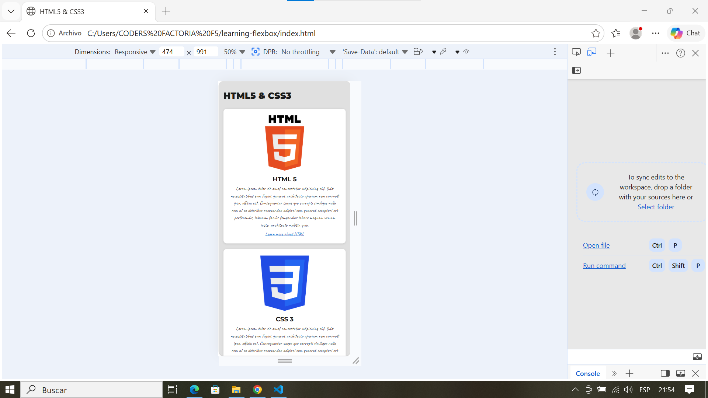

# 📐 HTML5 & CSS3 · Flexbox 

*"Todo encaja cuando sabes en qué dirección empujar."*

---

## 📖 Descripción

Este proyecto forma parte de un ejercicio de maquetación donde el objetivo
principal es practicar **Flexbox** para conseguir diseños **responsive**.

El reto: reproducir fielmente un layout de dos tarjetas, una para HTML5
y otra para CSS3, que se adapta a móvil y escritorio.

Solo con **HTML** y **CSS**, utilizando como texto un **lorem ipsum** y fuentes de **Google Fonts**.

---

## 🔍 Análisis

Antes de escribir código analicé los dos diseños (mobile y desktop) para identificar qué elementos HTML necesitaba y cómo se reorganizan según el dispositivo.
Analicé los dos diseños para identificar dónde actúa Flexbox en cada versión.
Identifiqué **3 niveles de Flexbox** anidados:

- El **contenedor principal** apila título y tarjetas en columna.
- Cada **card** cambia de columna (mobile) a fila (desktop).
- El **cuerpo de texto** de cada card organiza título, párrafo y enlace
  en columna.

---
**Lo que veo en la imagen:**

- Un `<h1>` con el título principal "HTML5 & CSS3"
- Dos tarjetas independientes — cada una es un bloque de contenido
  propio, así que usaré `<article>`
- Dentro de cada tarjeta:
  - Un `<figure>` con el `` del logo
  - Una `<section>` con el contenido de texto:
    - `<h2>` con el nombre de la tecnología
    - `
` con el texto 
    - `<a>` con el enlace "Learn more about..."

## 🗺️ Vistas

| Vista | Comportamiento |
|---|---|
| 📱 Mobile (< 768px) | Logo arriba, texto centrado debajo |
| 🖥️ Desktop (≥ 768px) | Logo a la izquierda, texto alineado a la derecha |

---

## 📐 Planificación

Estructura de archivos decidida antes de programar:

-   **`index.html`** — marcado semántico
-   **`styles/`** — CSS dividido por responsabilidad:
    -   `styles.css` → punto de entrada, solo `@import`
    -   `variables.css` → colores, fuentes y espaciado
    -   `base.css` → reset y estilos globales
    -   `layout.css` → contenedor principal y título
    -   `card.css` → componente tarjeta + media query mobile
    -   `responsive.css` → media query desktop
-   **`assets/imgs/`** — logos en SVG, diseño de referencia

Cada módulo CSS se desarrollará en su propia rama de Git para mantener
un historial limpio y ordenado.

---

## 🎨 Prototipo

Diseño de referencia proporcionado:

| Mobile | Desktop |
|---|---|
|  |  |

---

## 📋 Planificación de commits

- `chore`: add .gitignore
- `docs`: add README
- `feat`: add project folder structure
- `feat`: add HTML5 and CSS3 SVG logos
- `feat`: add base HTML structure
- `style`: add CSS variables and design
- `style`: add base styles and reset
- `style`: add layout styles
- `style`: add card component styles (mobile-first)
- `style`: add responsive layout for desktop (>=768px)
- `docs`: add final screenshot to README

---

## 🛠️ Tecnologías

- VS Code
- HTML5
- CSS3 — Flexbox, variables, media queries
- Google Fonts — 
- Git & GitHub

---

## 🔗 Recursos

- [Aprende HTML](https://lenguajehtml.com/html/)
- [Aprende CSS](https://lenguajecss.com/css/)

---

## 📸 Resultado final

### Desktop

### Mobile

---

## 🚀 Demo en vivo

👉 [Ver en GitHub Pages](https://Jennydev-25.github.io/learning-flexbox/)
